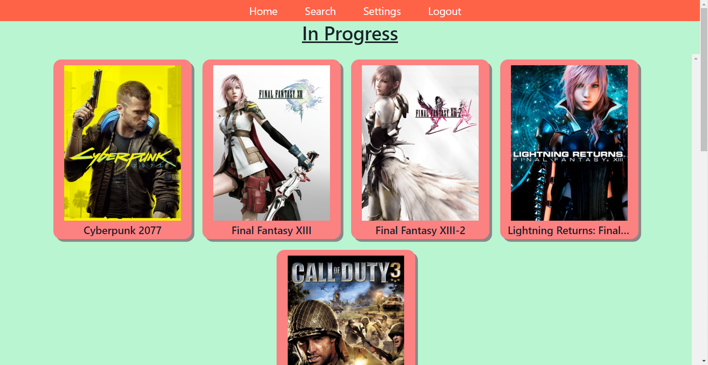
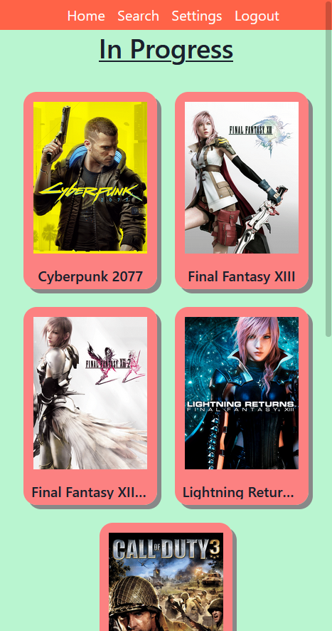

# Backlog Tracker
A web application that helps keep track of all the games that you have been meaning to play. Utilizing the [IGDB](https://www.igdb.com/discover) api, backlog tracker gains access to a wide selection of video games to allow the user to find all the games in their libraries. This application has been scaled to fit a wide variety of modern screens so that it is accessible to users no matter what device they are viewing the application from.

## Live Demo
Click [here](https://jdu-backlog-tracker.netlify.app/) for a live preview of the application.

<strong>Note:</strong> The application may take a few seconds to wake up when not in use for over 30mins.

## Technologies
- React
- Chakra UI
- Node.js
- Express
- RESTful API
- MongoDB

## Screenshots
Desktop View:

Mobile View:

